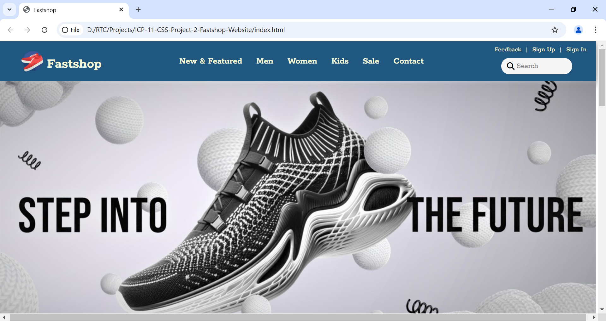

# Fastshop FastTreads Shoes Website🩰
[Visit Fastshop FastTreads Shoes Website📌](https://fastshop-fasttreads-shoes.netlify.app)

## Overview🌐
Welcome to the **Fastshop FastTreads Shoes Website** repository! This project is a CSS-focused endeavor aimed at creating a responsive and visually appealing website for FastTreads Shoes.

---
## Features🎯
1. Responsive Design: Ensures optimal viewing on desktops, tablets, and mobile devices.
   
2. Product Showcase: Highlights various shoe models with detailed descriptions and images.​

3. Interactive Elements: Incorporates hover effects and animations to enhance user engagement.​

4. Navigation: Provides intuitive navigation menus for seamless browsing.

---

---

##  Technologies Used

1. HTML5
   
2. CSS3
   
3. Flexbox & CSS Grid
   
4. Media Queries
   
---

## Our Contributors🚀

Thanks to these amazing people for their contributions!  

---

## Contact
Email📧: shravanikuldharan05@gmail.com

Github📌: https://github.com/Shravanikuldharan